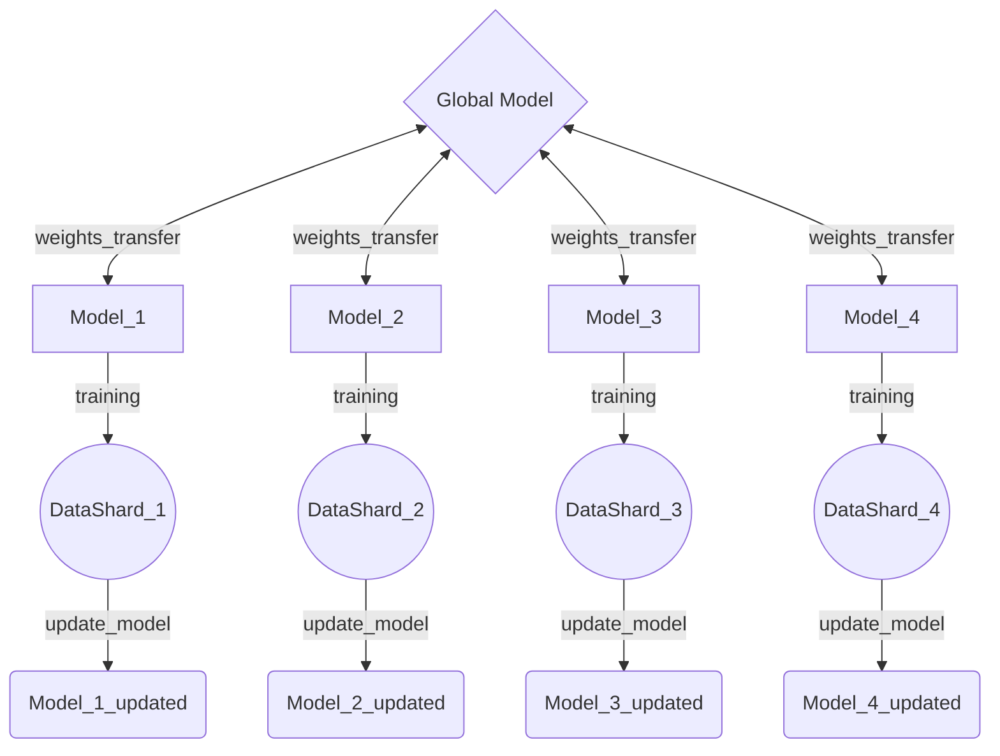

# More Medical Needs Suggestion by Decentralized Machine Learning Approach with COVID-19 Dataset.


## Description

Welcome! 😀

This work focused on the COVID-19 dataset provided by [this source](https://datos.gob.mx/busca/dataset/informacion-referente-a-casos-covid-19-en-mexico) provided by Mexico Government.

We managed to determine who would need more medical treatment among the hospitalized patients before they ended up in the ICU, by using who eventually went to the ICU or died as the classification criteria and other diseases and body condition as features.

---
## Stage 0: Data Exploration and Data Preprocessing

1. Original data features:

2. the feature now:

3. what we did in between and why.


## Stage I: Baseline Modeling

To create a baseline understanding of the project as well as testing our data cleaning accuracy, we delpoyed a set of traditional machine learning technique, the results for Cleveland datasets are shown as following.

| ML Technique  | Acc | Recall |
| ------------- | ------------- | ----- |
| Decision Tree  | 70.86% | 55.17% |
| Random Forest  | |   |
| SVM |  |   |
| Bayesian Classifier  |  |   |
| SOM |  |  |
| DNN | |   | 
| CNN | | | 
| RNN |  |  | 


## Stage II: Federated Learning
### Getting started with FL
* Download the [MNIST data set from Kaggle](https://www.kaggle.com/datasets/scolianni/mnistasjpg)
* Run the Python files
  ```sh
   python FL_demo/run_federated_learning.py
   ```
* Global Model Accuracy: ```80.20%```
* Check out [Flower](https://github.com/adap/flower) with more detailed explanation about FL.

### Our FL pipeline:

### Results:
* ```Learning rate```: 0.01
* ```Optimizer```: SGD
* ```Loss function```: Sparse Cross Entropy
* Result after 100 ```global epochs```:

  |Model Accuracy| Centralized  | Shard1 | Shard2 | Shard3 | Shard4 |
  |--------|--------|--------|--------|--------|--------|
  |DNN-FL||||||
  |CNN-FL||||||
  |RNN-FL||||||

  |Recall on Actual ICU or Dead| Centralized | Shard1 | Shard2 | Shard3 | Shard4 |
  |--------|--------|--------|--------|--------|--------|
  |DNN-FL||||||
  |CNN-FL||||||
  |RNN-FL||||||
  
---


## Analysis & Comparison


## Contact
Ethan Wang - [e13wang@gmail.com](e13wang@gmail.com) - [Linkedin Profile](https://www.linkedin.com/in/ethan-wang-938588175/)

Takeshi Matsuda - [takeshimatsuda27@gmail.com](takeshimatsuda27@gmail.com) - [Linkedin Profile](https://www.linkedin.com/in/takeshi-matsuda-41777b1ab/)

Project Link: [https://github.com/matsudatakeshi27/HeartDiseasePakula](https://github.com/matsudatakeshi27/HeartDiseasePakula)


## Acknowledgments:
* [Back-Propagation Neural Network Versus Logistic Regression in Heart Disease Classification](https://link.springer.com/chapter/10.1007/978-981-13-0680-8_13)
* [Heart Disease Risk Prediction Using Supervised Machine Learning Algorithms](https://link.springer.com/chapter/10.1007/978-981-99-0412-9_11)
* [HEART DISEASE PREDICTION USING DATA MINING TECHNIQUES](https://hal.science/hal-02196156/)
* [A Submodularity-based Agglomerative Clustering Algorithm for the Privacy Funnel](https://www.semanticscholar.org/paper/A-Submodularity-based-Agglomerative-Clustering-for-Ding-Sadeghi/4e7b3b31659c945ed0c953da9fe7af297b3f3675)
* [Early detection of silent ischaemic heart disease by 24-hour electrocardiographic monitoring of active subjects.](https://www.ncbi.nlm.nih.gov/pmc/articles/PMC458846/)
* [Development of a federated learning approach to predict acute kidney injury in adult hospitalized patients with COVID-19 in New York City](https://www.ncbi.nlm.nih.gov/pmc/articles/PMC8328073/)
* [Federated learning for multi-center imaging diagnostics: a simulation study in cardiovascular disease](https://www.nature.com/articles/s41598-022-07186-4)
